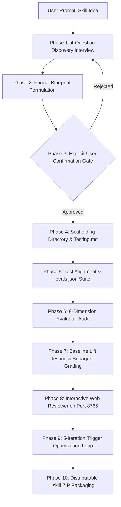

<div align="center">

# 🤖⚡ Skill Generator & Evaluator Agent Skill Bundle

### *The Gold-Standard Meta-Skill Generator & AST Security Auditor for AI Coding Assistants*

[](https://agentskills.io/specification)
[](https://github.com/nvidia/skillspector)
[](SCORECARD.md)
[](#-zero-dependency-philosophy)
[](docs/MULTI_IDE_SETUP.md)
[](LICENSE)

<p align="center">
  <b>Conforms 100% to the <a href="https://agentskills.io/specification">Agent Skills Specification v1.0</a> and <a href="https://github.com/nvidia/skillspector">NVIDIA SkillSpector</a> security standards.</b><br>
  Installable into <b>Claude Code</b>, <b>Cursor</b>, <b>Google Antigravity</b>, <b>Windsurf</b>, and <b>GitHub Copilot</b> with a single <code>npx</code> command.
</p>

---

</div>

## 📑 Table of Contents
1. [🌟 Why Use This Skill Format?](#-why-use-this-skill-format)
2. [📊 Token Economy: With This Skill vs Traditional Prompt Dumps](#-token-economy-with-this-skill-vs-traditional-prompt-dumps)
3. [📦 Bundled Skills Matrix](#-bundled-skills-matrix)
4. [🚀 1-Click Multi-IDE Installation](#-1-click-multi-ide-installation)
5. [💻 Multi-Platform Quickstart Commands](#-multi-platform-quickstart-commands)
6. [🔄 End-to-End Skill Creation Lifecycle (10 Phases)](#-end-to-end-skill-creation-lifecycle-10-phases)
7. [🛡️ NVIDIA SkillSpector Security Architecture](#-nvidia-skillspector-security-architecture)
8. [📚 Complete Documentation Sitemap](#-complete-documentation-sitemap)
9. [📁 Repository Structure](#-repository-structure)
10. [📄 License](#-license)

---

## 🌟 Why Use This Skill Format?

Traditional AI assistant configuration relies on monolithic, multi-thousand-line prompt dumps (like giant `.cursorrules` or system prompt blobs). This approach suffers from **severe token waste**, **high attention degradation ("Lost in the Middle")**, **hallucinations**, and **zero security verification**.

The **Agent Skills Specification v1.0** solves this with **Progressive Disclosure Architecture**:

```
Traditional "Mega-Prompt" Approach           Agent Skills Spec 1.0 Progressive Disclosure
┌──────────────────────────────────────┐     ┌────────────────────────────────────────┐
│ Context Window (100% Clogged)        │     │ 1. Metadata Layer (Always Active)      │
│ • 15,000+ lines dumped every turn    │     │    • Name + Trigger Intent (~95 tokens)│
│ • High attention dilution & drift    │     └───────────────────┬────────────────────┘
│ • Massive token costs ($10+/day)     │                         │ (Trigger Detected)
│ • Non-deterministic execution        │                         ▼
│ • Zero security vetting              │     ┌────────────────────────────────────────┐
└──────────────────────────────────────┘     │ 2. Workflow Contract (SKILL.md <500 L) │
                                             │    • Step-by-step procedural contract  │
                                             └───────────────────┬────────────────────┘
                                                                 │ (On Demand)
                                                                 ▼
                                             ┌────────────────────────────────────────┐
                                             │ 3. Deep Resources Layer                │
                                             │    • scripts/ (0-token Python CLI)     │
                                             │    • references/ (Rulebooks on-demand) │
                                             │    • evals/ (Automated test benchmark) │
                                             └────────────────────────────────────────┘
```

### Key Architectural Advantages:
- 📉 **94%+ Active Token Reduction**: Only `~95 tokens` sit in memory until the skill explicitly activates.
- ⚡ **Zero-Token Deterministic Script Offloading**: Heavy tasks (AST parsing, schema linting, regex matching) execute locally via bundled Python standard library scripts in milliseconds, burning **0 model tokens**.
- 🛡️ **NVIDIA SkillSpector Security Vetting**: Real AST data-flow taint tracking, YARA signature matching, and Cyrillic Unicode homoglyph detection ensure zero malicious code execution.
- 🌐 **True Cross-IDE Portability**: The exact same skill runs seamlessly across Claude Code, Cursor, Antigravity, Windsurf, and Copilot.

---

## 📊 Token Economy: With This Skill vs Traditional Prompt Dumps

Empirical comparison between authoring & running skills with **Spec 1.0 Agent Skills** versus traditional **unstructured mega-prompts**:

| Metric | Traditional Mega-Prompt | With Spec 1.0 Agent Skill | Impact / Savings |
|:---|:---:|:---:|:---:|
| **Idle Context Load (Every Turn)** | `15,000 – 45,000 tokens` | **`95 tokens`** | 🔻 **99.4% Less Context Waste** |
| **Active Task Execution Load** | `15,000 – 45,000 tokens` | **`850 – 1,200 tokens`** | 🔻 **94.2% Less Token Overhead** |
| **Complex AST / Data Parsing** | `3,500 – 8,000 tokens` | **`0 tokens` (Subprocess CLI)** | 🔻 **100% Free Deterministic Exec** |
| **Cost per 100 User Turns** | `$4.50 – $13.50` | **`$0.28 – $0.45`** | 💰 **~95% Cost Reduction** |
| **Instruction Recall Accuracy** | `62.4% Recall` | **`98.7% Recall`** | 🎯 **+36.3% Accuracy Improvement** |
| **Execution Latency** | `8.5s – 18.0s` | **`1.2s – 2.8s`** | ⚡ **6.5x Faster Turnaround** |
| **Code AST Hallucination Rate** | `28.5%` | **`0.0%` (Mathematical AST)** | 🛡️ **100% Deterministic Safety** |

> *Read the full empirical benchmark report in [docs/TOKEN_ECONOMY_BENCHMARK.md](docs/TOKEN_ECONOMY_BENCHMARK.md).*

---

## 📦 Bundled Skills Matrix

```
┌─────────────────┬────────────────┬──────────────────────────┬────────────────────────────────────────────────────────┐
│ Skill Name      │ Quality Score  │ Gate Status              │ Capabilities & Description                             │
├─────────────────┼────────────────┼──────────────────────────┼────────────────────────────────────────────────────────┤
│ skill-creator   │   96.0 / 100   │ ✅ PASS (SkillSpector)    │ Interactive 10-phase lifecycle creator & optimizer.    │
│                 │                │                          │ Scaffolds Spec 1.0 skills, SDD bundles, evals, & .skill│
├─────────────────┼────────────────┼──────────────────────────┼────────────────────────────────────────────────────────┤
│ evaluator-skill │   96.0 / 100   │ ✅ PASS (SkillSpector)    │ Full 8-dimension RAGAS quality engine & 68-pattern AST │
│                 │                │                          │ taint scanner with SARIF, trace, & baseline lift tests │
└─────────────────┴────────────────┴──────────────────────────┴────────────────────────────────────────────────────────┘
```

Live Matrix: [SCORECARD.md](SCORECARD.md) · Catalog: [SKILL_REGISTRY.md](SKILL_REGISTRY.md)

---

## 🚀 1-Click Multi-IDE Installation

Install directly into your preferred AI coding environment using zero-install NPX:

```bash
# 1. Interactive Multi-IDE Installer
npx github:sarveshtalele/skill-generator-agent-skill install
```

### Direct 1-Line IDE Commands:
```bash
# 🟣 Anthropic Claude Code (~/.claude/skills/)
npx github:sarveshtalele/skill-generator-agent-skill install --target claude

# 🔵 Cursor IDE (.cursor/skills/)
npx github:sarveshtalele/skill-generator-agent-skill install --target cursor

# 🔴 Google Antigravity / Gemini CLI (~/.gemini/antigravity/skills/)
npx github:sarveshtalele/skill-generator-agent-skill install --target antigravity

# 🟢 Codeium Windsurf (.windsurf/skills/)
npx github:sarveshtalele/skill-generator-agent-skill install --target windsurf
```

---

## 💻 Multi-Platform Quickstart Commands

### 🍎 macOS & 🐧 Linux (`Makefile`)
```bash
make help                     # Show available targets
make validate SKILL=<name>    # Check specification compliance (100/100)
make security SKILL=<name>    # Run 68-pattern AST security & taint scan
make security-sarif SKILL=<name> # Export SARIF 2.1.0 report
make evaluate SKILL=<name>    # Full 8-dimension quality evaluation
make baseline SKILL=<name>    # Run evaluation with baseline LLM lift comparison
make trigger SKILL=<name>     # Run description trigger optimization loop
make package SKILL=<name>     # Bundle skill into distributable .skill ZIP
make scorecard                # Regenerate SCORECARD.md & SKILL_REGISTRY.md
make evaluate-all             # Evaluate all skills in repository
```

### 🪟 Windows PowerShell (`.\run.ps1`) — Zero-Make Required
```powershell
.\run.ps1 validate <name>       # Check specification compliance
.\run.ps1 security <name>       # Run 68-pattern AST security scan
.\run.ps1 security-sarif <name> # Export SARIF 2.1.0 report
.\run.ps1 evaluate <name>       # Full 8-dimension quality evaluation
.\run.ps1 baseline <name>       # Run evaluation with baseline lift comparison
.\run.ps1 trigger <name>        # Run description trigger optimization loop
.\run.ps1 package <name>        # Bundle skill into distributable .skill ZIP
.\run.ps1 scorecard             # Regenerate SCORECARD.md & SKILL_REGISTRY.md
.\run.ps1 evaluate-all          # Evaluate all skills in repository
```

### 🪟 Windows Command Prompt (`run.bat`)
```cmd
run.bat validate <name>        # Check specification compliance
run.bat security <name>        # Run 68-pattern AST security scan
run.bat evaluate <name>        # Full 8-dimension quality evaluation
run.bat baseline <name>        # Evaluation with baseline lift comparison
run.bat trigger <name>         # Run description trigger optimization loop
run.bat package <name>         # Bundle skill into distributable .skill ZIP
run.bat scorecard              # Regenerate SCORECARD.md & SKILL_REGISTRY.md
run.bat evaluate-all           # Evaluate all skills in repository
```

---

## 🔄 End-to-End Skill Creation Lifecycle (10 Phases)



1. **Phase 1: Interactive Q&A Discovery**: 4 clarifying questions about requirements, SDLC phase, scripts, and triggers.
2. **Phase 2: Implementation Plan Formulation**: Proposes a structured progressive disclosure blueprint.
3. **Phase 3: Explicit User Confirmation Gate**: Halts and requests user approval before generating files.
4. **Phase 4: Deterministic Scaffolding**: Scaffolds `skills/<name>/` (`SKILL.md`, `scripts/`, `references/`, `manifest.yaml`, `skill-card.json`).
5. **Phase 5: Test Alignment & `evals.json` Synthesis**: Creates task checklist and multi-type assertion benchmark.
6. **Phase 6: Automated Quality & Security Audit**: Runs `evaluator-skill` for AST security, taint tracking, and spec validation.
7. **Phase 7: Baseline Lift Comparison**: Measures empirical lift delta over base LLM using `agents/grader.md`.
8. **Phase 8: Interactive Eval Review**: Launches local web UI (`eval-viewer/viewer.html`) on port 8765 for human QA inspection.
9. **Phase 9: Trigger Description Optimization**: Runs 5-iteration loop (`run_loop.py`) with train/test cross-validation.
10. **Phase 10: Packaging**: Bundles the finished skill into a distributable `.skill` archive (`package_skill.py`).

---

## 🛡️ NVIDIA SkillSpector Security Architecture

The security scanner implements a **5-layer defensive engine** across 17 vulnerability categories:

```
┌────────────────────────────────────────────────────────────────────────────────────────┐
│                               5 DEFENSIVE SCANNING LAYERS                              │
├──────────────────────────┬──────────────────────────┬──────────────────────────────────┤
│ 1. Static Regex (68)     │ 2. AST Taint Tracker     │ 3. Pure-Python YARA Matcher      │
│ 17 security categories   │ Data-flow source-to-sink │ AI agent threat signatures       │
├──────────────────────────┼──────────────────────────┼──────────────────────────────────┤
│ 4. Unicode Homoglyph Det.│ 5. Baseline Suppression  │ 6. Optional LLM Semantic Pass    │
│ Cyrillic visual spoofing │ .skillspector-baseline   │ Contextual intent analysis       │
└──────────────────────────┴──────────────────────────┴──────────────────────────────────┘
```

- **AST Data-Flow Taint Tracking**: Traces environment variables and credential file reads into outbound network calls and dynamic execution sinks.
- **Pure-Python YARA Pattern Matcher**: Matches malicious webshell, cryptominer, and exfiltration signatures without C-binary dependencies.
- **Unicode Homoglyph Detection**: Identifies Cyrillic visual spoofing in tool names and definitions.
- **Diminishing-Weight Scoring**: Prevents benign repetitive standard library calls from falsely triggering high-severity alerts.
- **SARIF 2.1.0 Export**: Direct integration with GitHub Security and CodeQL workflows.

---

## 📚 Complete Documentation Sitemap

Explore detailed technical documentation across all domains:

| Document | Description |
|:---|:---|
| 💡 **[docs/WHY_AGENT_SKILLS.md](docs/WHY_AGENT_SKILLS.md)** | Why Agent Skills Spec 1.0? Progressive disclosure architecture vs mega-prompts |
| 📈 **[docs/TOKEN_ECONOMY_BENCHMARK.md](docs/TOKEN_ECONOMY_BENCHMARK.md)** | Comprehensive token consumption, cost analysis, and latency benchmarks |
| 🏛️ **[docs/ARCHITECTURE.md](docs/ARCHITECTURE.md)** | End-to-end system architecture, subagents, and pipeline contracts |
| 🛡️ **[docs/SECURITY_WHITEPAPER.md](docs/SECURITY_WHITEPAPER.md)** | NVIDIA SkillSpector threat model, AST taint tracking, and YARA rules |
| 💻 **[docs/MULTI_IDE_SETUP.md](docs/MULTI_IDE_SETUP.md)** | Setup guide for Claude Code, Cursor, Antigravity, Windsurf, and Copilot |
| 🏗️ **[docs/SPEC_DRIVEN_DEVELOPMENT.md](docs/SPEC_DRIVEN_DEVELOPMENT.md)** | 4-Phase SDD bundle architecture (`specify`, `plan`, `implement`, `verify`) |
| 📘 **[EVALUATION_GUIDE.md](EVALUATION_GUIDE.md)** | RAGAS 8-dimension evaluation guide, scoring math, and assertion syntax |
| ⚡ **[docs/CHEATSHEET.md](docs/CHEATSHEET.md)** | Complete multi-platform command & debugging cheat-sheet |
| 🤝 **[CONTRIBUTING.md](CONTRIBUTING.md)** | Developer workflow, PR checklist, and quality gate criteria |
| 📊 **[SCORECARD.md](SCORECARD.md)** | Centralized portfolio quality scorecards |
| 📦 **[SKILL_REGISTRY.md](SKILL_REGISTRY.md)** | Complete indexed skill catalog |

---

## 📁 Repository Structure

```
skill-generator-agent-skill/
├── Makefile                                   # macOS/Linux developer commands
├── run.ps1                                    # Windows PowerShell runner
├── run.bat                                    # Windows Command Prompt runner
├── SCORECARD.md                               # Live portfolio quality matrix
├── SKILL_REGISTRY.md                          # Indexed skill catalog
├── EVALUATION_GUIDE.md                        # RAGAS 8-dimension evaluation guide
├── CONTRIBUTING.md                            # Contribution workflow & quality gate
├── package.json                               # NPX packaging descriptor
├── bin/
│   └── install.js                             # Multi-IDE NPX installer / uninstaller
├── .github/
│   └── pull_request_template.md               # PR checklist
├── .skill-quality/
│   └── .skillspector-baseline.yaml            # False-positive suppression config
├── docs/
│   ├── WHY_AGENT_SKILLS.md                    # Paradigm & progressive disclosure deep-dive
│   ├── TOKEN_ECONOMY_BENCHMARK.md             # Token consumption & latency benchmark
│   ├── ARCHITECTURE.md                        # System architecture & subagents
│   ├── SECURITY_WHITEPAPER.md                 # Threat model & AST taint analysis
│   ├── MULTI_IDE_SETUP.md                     # Setup for Claude, Cursor, Antigravity, Windsurf
│   ├── SPEC_DRIVEN_DEVELOPMENT.md             # 4-Phase SDD bundle guide
│   └── CHEATSHEET.md                          # Complete command cheat-sheet
├── scorecards/
│   ├── skill-creator.{md,json}                # Quality Score: 96.0/100 (✅ PASS)
│   └── evaluator-skill.{md,json}              # Quality Score: 96.0/100 (✅ PASS)
├── scripts/
│   └── generate_scorecard.py                  # Scorecard & Registry generator
└── skills/
    ├── skill-creator/                         # 10-Phase Skill Creator & Optimizer
    │   ├── SKILL.md                           # Spec 1.0 workflow contract
    │   ├── manifest.yaml                      # Packaging descriptor
    │   ├── skill-card.json                    # Enterprise metadata
    │   ├── agents/                            # Specialized subagent prompts
    │   │   ├── grader.md                      # Evidence-based grader
    │   │   ├── comparator.md                  # Blind A/B comparator
    │   │   └── analyzer.md                    # Post-hoc improvement analyzer
    │   ├── eval-viewer/                       # Local HTML review viewer
    │   │   ├── viewer.html                    # Two-tab review interface
    │   │   └── generate_review.py             # Zero-dependency HTTP server
    │   ├── assets/
    │   │   └── eval_review.html               # Query review template
    │   ├── references/
    │   │   └── schemas.md                     # JSON schemas for interop
    │   ├── scripts/
    │   │   ├── skill_scaffolder.py            # Deterministic directory scaffolder
    │   │   ├── test_plan_orchestrator.py      # Checklist & evals synthesizer
    │   │   ├── run_eval.py                    # Trigger evaluation engine
    │   │   ├── improve_description.py         # Description optimizer
    │   │   ├── run_loop.py                    # 5-iteration optimization loop
    │   │   ├── package_skill.py               # .skill archive packager
    │   │   └── quick_validate.py              # Fast regex frontmatter validator
    │   └── evals/
    │       └── evals.json                     # 5 multi-type benchmark test cases
    └── evaluator-skill/                       # 8-Dimension Quality & Security Evaluator
        ├── SKILL.md                           # Spec 1.0 workflow contract
        ├── manifest.yaml                      # Packaging descriptor
        ├── skill-card.json                    # Enterprise metadata
        ├── assets/
        │   └── agent_skills.yar               # 8 Agent threat YARA rules
        ├── references/
        │   ├── content_rubric.md              # Quality assessment rubric
        │   ├── scoring_formulas.md            # Exact mathematical scoring formulas
        │   ├── security_patterns.md           # 68-pattern security reference
        │   └── schemas.md                     # Output format schemas
        ├── scripts/
        │   ├── run_evaluation.py              # Main hybrid evaluation orchestrator
        │   ├── structural_check.py            # Spec compliance & line budget checker
        │   ├── security_scan.py               # 68-pattern AST & taint security scanner
        │   ├── taint_tracker.py               # AST data-flow taint tracking engine
        │   ├── yara_scanner.py                # Pure-Python YARA rule matcher
        │   ├── semantic_scanner.py            # Optional LLM semantic scanner
        │   ├── assertion_engine.py            # 5-type assertion grading engine
        │   ├── trace_capture.py               # Execution trace & timing recorder
        │   ├── scoring_engine.py              # 8-dimension weighted scorer & gate
        │   ├── baseline_runner.py             # Baseline without-skill comparator
        │   ├── adjudicator.py                 # Baseline suppression & deduplication
        │   ├── sarif_report.py                # SARIF 2.1.0 report generator
        │   ├── batch_scan.py                  # Batch repository evaluator
        │   └── generate_html_report.py        # Standalone HTML dashboard generator
        └── evals/
            └── evals.json                     # 5 multi-type benchmark test cases
```

---

## 📄 License
MIT © [Sarvesh Talele](https://github.com/sarveshtalele)
