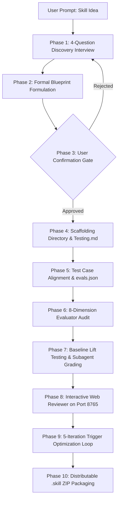

# 🏛️ System Architecture: Skill Generator & Evaluator Bundle

This document details the architectural blueprint, data flow pipelines, component contracts, and subagent interactions of the **`skill-generator-agent-skill`** repository.

---

## 🗺️ High-Level System Architecture

```
┌────────────────────────────────────────────────────────────────────────────────────────┐
│                                   CLIENT INTERFACES                                    │
│       Claude Code   ·   Cursor Composer   ·   Antigravity   ·   Windsurf   ·   Copilot │
└───────────────────────────────────────────┬────────────────────────────────────────────┘
                                            │ (Invokes NPX Installer / Direct Skill Call)
                                            ▼
┌────────────────────────────────────────────────────────────────────────────────────────┐
│                        AGENT SKILLS RUNTIME LAYER (Spec 1.0)                           │
│                                                                                        │
│   ┌────────────────────────────────────────┐   ┌───────────────────────────────────┐   │
│   │        skill-creator (v2.0.0)          │   │      evaluator-skill (v2.0.0)     │   │
│   │  • 10-Phase Creation Lifecycle         │   │  • 8-Dimension Quality Engine     │   │
│   │  • Interactive Q&A Architect Chatbot   │   │  • NVIDIA SkillSpector 68 AST     │   │
│   │  • Scaffolding Engine                  │   │  • Data-Flow Taint Tracker        │   │
│   │  • Trigger Optimizer (Train/Test Loop) │   │  • Pure-Python YARA Matcher       │   │
│   │  • Subagents (Grader/Comparator)       │   │  • Multi-Type Assertion Evaluator │   │
│   │  • Local Web Eval-Viewer (Port 8765)   │   │  • SARIF 2.1.0 & Telemetry Trace  │   │
│   └────────────────────────────────────────┘   └───────────────────────────────────┘   │
└───────────────────────────────────────────┬────────────────────────────────────────────┘
                                            │ (Subprocess CLI Executions - Zero External Dependencies)
                                            ▼
┌────────────────────────────────────────────────────────────────────────────────────────┐
│                      DETERMINISTIC PYTHON STDLIB ENGINE LAYER                          │
│   ast · re · json · pathlib · dataclasses · http.server · zipfile · base64 · argparse │
└───────────────────────────────────────────┬────────────────────────────────────────────┘
                                            │ (Emits Formatted Quality Artifacts)
                                            ▼
┌────────────────────────────────────────────────────────────────────────────────────────┐
│                                OUTPUT ARTIFACTS                                        │
│  • SCORECARD.md        • SKILL_REGISTRY.md    • results.sarif       • dist/*.skill     │
│  • trace.json          • timing.json          • benchmark.json      • evals.json       │
└────────────────────────────────────────────────────────────────────────────────────────┘
```

---

## 🔄 The 10-Phase Skill Creation Pipeline (`skill-creator`)



### Component Breakdown
1. **Interactive Chatbot State Machine (`SKILL.md`)**: Defines conversational state transitions preventing premature file generation.
2. **Deterministic Scaffolder (`skill_scaffolder.py`)**: Builds canonical directory trees, spec-compliant frontmatter, and starter templates.
3. **Test Orchestrator (`test_plan_orchestrator.py`)**: Generates verification checklists and benchmark assertion suites.
4. **Trigger Loop Engine (`run_loop.py` & `improve_description.py`)**: Splits trigger queries into 60% train / 40% test sets and refines frontmatter descriptions until F1 $\ge 0.80$.
5. **Subagents (`agents/`)**:
   - `grader.md`: Evidence-based pass/fail grading.
   - `comparator.md`: Blind A/B output comparison.
   - `analyzer.md`: Post-hoc improvement synthesis.

---

## 🛡️ The 8-Dimension Evaluation Engine (`evaluator-skill`)

```
Evaluation Execution Flow:
run_evaluation.py
    │
    ├── 1. structural_check.py  ──> Validates Frontmatter, Naming Regex, & Link Containment
    ├── 2. security_scan.py     ──> 68 Static AST Patterns + Unicode Homoglyphs
    ├── 3. taint_tracker.py     ──> AST Data-Flow Source-to-Sink Tracking
    ├── 4. yara_scanner.py      ──> Matches agent_skills.yar Signatures
    ├── 5. assertion_engine.py  ──> Evaluates contains:, matches:, file:, json:, semantic
    ├── 6. trace_capture.py     ──> Records trace.json & timing.json
    ├── 7. baseline_runner.py   ──> Computes Empirical Lift Delta (With-Skill vs Base LLM)
    └── 8. scoring_engine.py    ──> Computes Weighted Composite Score & Applies Quality Gate
```

### Scoring Formula Weights
$$\text{Quality Score} = 0.10 S_1 + 0.15 S_2 + 0.25 S_3 + 0.15 S_4 + 0.10 S_5 + 0.05 S_6 + 0.05 S_7 + 0.15 S_8$$

- **Quality Gate**:
  - `PASS`: Score $\ge 95.0$ AND 0 Critical/High Security AND Functional $\ge 80\%$.
  - `WARN`: $75.0 \le \text{Score} < 95.0$ AND 0 Critical Security.
  - `BLOCK`: Score $< 75.0$ OR $\ge 1$ Critical Security Finding OR Functional $< 80\%$.
